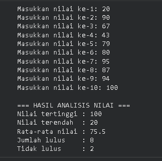
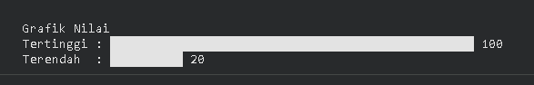
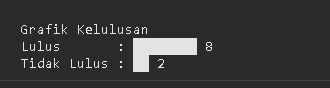

# PROJECT-TUGAS
#1. Penjelasan Konsep Array

Array adalah struktur data yang digunakan untuk menyimpan beberapa data dengan tipe yang sama dalam satu variabel. Data dalam array disimpan secara berurutan dan setiap data memiliki index untuk mengaksesnya. Pada program ini, array digunakan untuk menyimpan 10 nilai mahasiswa sehingga lebih mudah melakukan proses seperti mencari nilai tertinggi, nilai terendah, menghitung rata-rata, dan menentukan jumlah mahasiswa yang lulus.

#2. Screenshot Hasil Eksekusi

#3. Analisis Kompleksitas
| Operasi                 | Kompleksitas |
| ----------------------- | ------------ |
| Input nilai             | **O(n)**     |
| Mencari nilai tertinggi | **O(n)**     |
| Mencari nilai terendah  | **O(n)**     |
| Menghitung rata-rata    | **O(n)**     |
| Menghitung jumlah lulus | **O(n)**     |

#4. Refleksi Pembelajaran

Dari tugas ini saya memahami bagaimana menggunakan array untuk menyimpan banyak data dalam satu variabel sehingga memudahkan proses pengolahan data. Saya juga belajar membuat program untuk mencari nilai tertinggi, nilai terendah, menghitung rata-rata, serta menentukan jumlah mahasiswa yang lulus. Selain itu saya memahami konsep kompleksitas algoritma, yaitu bagaimana waktu eksekusi program dipengaruhi oleh jumlah data yang diproses.
